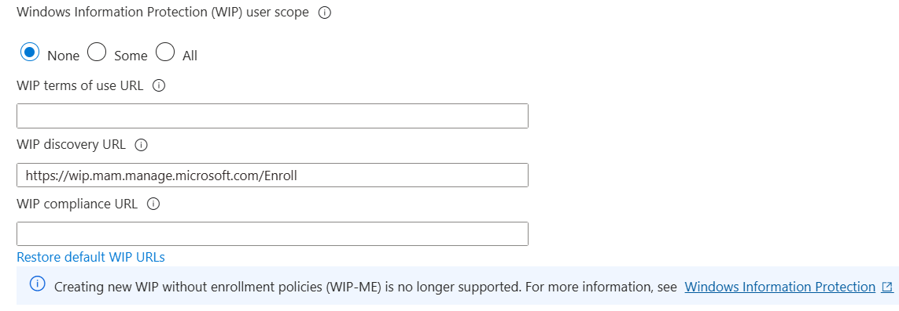

# Windows 11 Upgrade Simulation Using Microsoft Intune

## 🛠️ Overview
This project simulates an enterprise-scale upgrade of Windows 10 devices to Windows 11 using Microsoft Intune and Endpoint Manager. The goal was to mirror what an organization like LA Care Health Plan would most likely perform during a real-world upgrade of 3,900 managed workstations.

Using a Microsoft 365 Business Premium trial, I enrolled a Windows 10 VM into Intune, assigned a Windows Update Ring to upgrade to Windows 11, and applied a compliance policy to enforce enterprise security standards.

---

## ✅ Objectives
- Set up a Microsoft 365 tenant and access Microsoft Endpoint Manager (Intune)
- Create and assign a Windows 11 Update Ring policy
- Create and assign a Windows 11 Compliance Policy
- Enroll a Windows 10 virtual machine into Intune
- Validate policy deployment, compliance status, and device registration

---

## 💻 Tools & Technologies
- Microsoft 365 Business Premium Trial
- Microsoft Endpoint Manager (Intune)
- Azure Active Directory (AAD)
- Windows 10 Virtual Machine (VirtualBox)

---

## 🧭 Project Steps

### 🔹 1. Setup & Environment
- Registered a free M365 Business Premium trial
- Created a test user and assigned an Intune license
  
- Verified MDM auto-enrollment settings

### 🔹 2. Intune Policy Creation

#### ✅ Windows Update Ring
- Enabled automatic upgrade to Windows 11
- Configured update behavior (7-day deadline, 1-day grace)
- Assigned to **All Devices**
 
<b>Allow Microsoft Product Updates</b> - This ensures updates for Microsoft apps like Office, Edge, etc., are delivered along with Windows Updates
<b>Allow Windows driver</b> - Allows Windows Update to install updated hardware drivers  
<b> Quality update deferral period & Feature update deferral period</b> - We don't want any delays so I set it to 0.

 
<b>Set feature update uninstall period (days) -> 10</b> - If a user runs into issues, they can roll back the OS upgrade within this number of days

 
Deadline for feature updates -> 7. Devices must install Windows 11 within 7 days of poliy assignment
 
Deadline for quality updates -> 2. Security Patches must install within 2 days
 
Grace Period -> 1. After deadline passes, the user has 1 more day before reboot is forced.

#### ✅ Compliance Policy
- Required minimum OS version: `10.0.22000.0` (Windows 11)
- Enforced BitLocker, Secure Boot, AV, and firewall
- Assigned to **All Devices**

### 🔹 3. Device Enrollment & Sync

#### VM Setup
- Created a Windows 10 VM in VirtualBox
- Set correct time zone and verified network access

#### Azure AD Join
- Joined the device using the test user under `Access work or school`

However, at this step I encountered an error:

To fix this I had to set WIP user scope to none since I’m not using any WIP policies it didn’t have any functional impact on me.
 

#### Device Enrollment Confirmation

