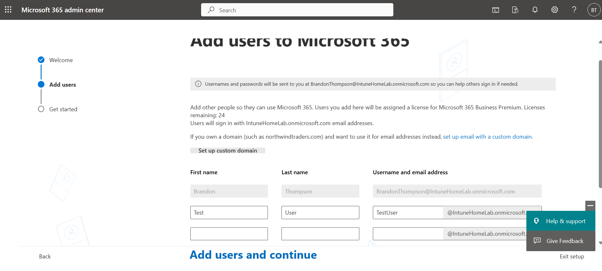

# Windows 11 Upgrade Simulation Using Microsoft Intune

## 🛠️ Overview
This project simulates an enterprise-scale upgrade of Windows 10 devices to Windows 11 using Microsoft Intune and Endpoint Manager. The goal was to mirror what a company like LA Care Health Plan would perform during a real-world upgrade of 3,900 managed workstations.

Using a Microsoft 365 Business Premium trial, I enrolled a Windows 10 VM into Intune, assigned a Windows Update Ring to upgrade to Windows 11, and applied a compliance policy to enforce enterprise security standards.

---

## ✅ Objectives
- Set up a Microsoft 365 tenant and access Microsoft Endpoint Manager (Intune)
- Create and assign a Windows 11 Update Ring policy
- Create and assign a Windows 11 Compliance Policy
- Enroll a Windows 10 virtual machine into Intune
- Validate policy deployment, compliance status, and device registration
- Document the entire process for resume and portfolio use

---

## 💻 Tools & Technologies
- Microsoft 365 Business Premium Trial
- Microsoft Endpoint Manager (Intune)
- Azure Active Directory (AAD)
- Windows 10 Virtual Machine (VirtualBox)
- Windows Update for Business (WUfB)

---

## 🧭 Project Steps

### 🔹 1. Setup & Environment
- Registered a free M365 Business Premium trial
- Created a test user and assigned an Intune license
  
- Verified MDM auto-enrollment settings

### 🔹 2. Intune Policy Creation

#### ✅ Windows Update Ring
- Enabled automatic upgrade to Windows 11
- Configured update behavior (7-day deadline, 1-day grace)
- Assigned to **All Devices**
 
<b>Allow Microsoft Product Updates</b> - This ensures updates for Microsoft apps like Office, Edge, etc., are delivered along with Windows Updates
<b>Allow Windows driver</b> - Allows Windows Update to install updated hardware drivers  
<b> Quality update deferral period & Feature update deferral period</b> - We don't want any delays so I set it to 0.

 

